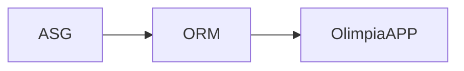

# OlimapiaAPP-IA

## Pipeline

1. Answer Sheet Generator (ASG) we need to generate the template.
2. Optical Mark Recognition (OMR) extract the answers on the paper.
3. Send the information to OliampiaAPP.
